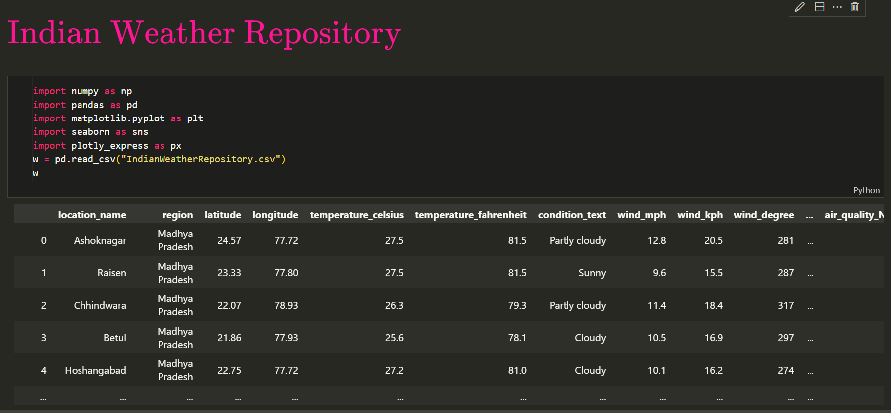

 
<h1 align="center"> Indian Weather 🌧️</h1>

<h2>This project is made using Python library tkinter for GUI.</h2>
<h2>It displays the temperature and climate of the Indian cities.</h2>

## Attributes of the given dataset
  
- country: Country of the weather data 
- location_name: Name of the location (city)
- region: Administrative region of the location
- latitude: Latitude coordinate of the location
- longitude: Longitude coordinate of the location
- temperature_celsius: Temperature in degrees Celsius
- temperature_fahrenheit: Temperature in degrees Fahrenheit
- condition_text: Weather condition description
- wind_mph: Wind speed in miles per hour
- wind_kph: Wind speed in kilometers per hour
- wind_degree: Wind direction in degrees
- wind_direction: Wind direction as 16-point compass
- pressure_mb: Pressure in millibars
- pressure_in: Pressure in inches
- precip_mm: Precipitation amount in millimeters
- precip_in: Precipitation amount in inches
- humidity: Humidity as a percentage
- cloud: Cloud cover as a percentage
- feels_like_celsius: Feels-like temperature in Celsius
- feels_like_fahrenheit: Feels-like temperature in Fahrenheit
- visibility_km: Visibility in kilometers
- visibility_miles: Visibility in miles
- uv_index: UV Index
- air_quality_Carbon_Monoxide: Air quality measurement: Carbon Monoxide
- air_quality_Ozone: Air quality measurement: Ozone
- air_quality_Nitrogen_dioxide: Air quality measurement: Nitrogen Dioxide
- air_quality_Sulphur_dioxide: Air quality measurement: Sulphur Dioxide
- air_quality_PM2.5: Air quality measurement: PM2.5
- air_quality_PM10: Air quality measurement: PM10
- sunrise: Local time of sunrise
- sunset: Local time of sunset
- moonrise: Local time of moonrise
- moonset: Local time of moonset
- moon_phase: Current moon phase
- moon_illumination: Moon illumination percentage

